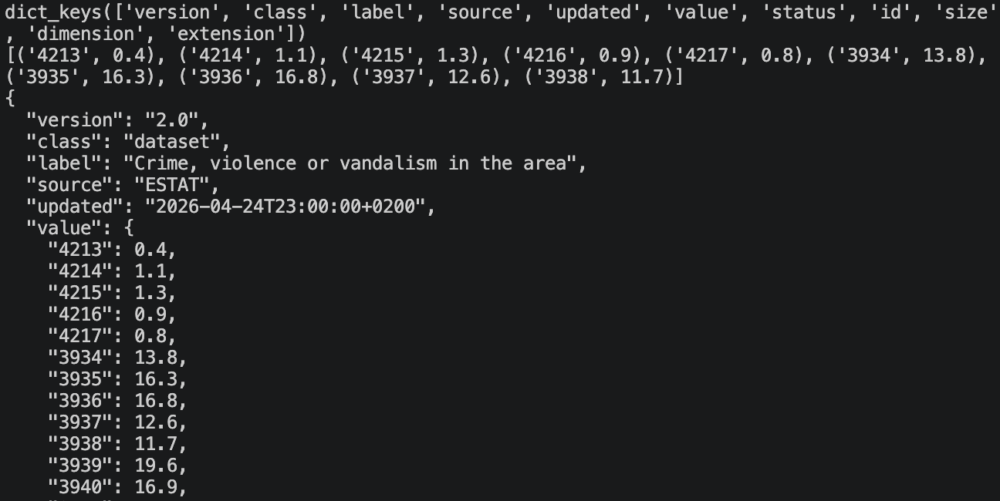

# Project Description
Housing in Europe has become an issue for many citizens due to a limited supply, rising costs, and reduced affordability. Using datasets from Eurostat, EuroHome aims to calculate the best housing for users based on environmental factors such as crime, population, urbanness and age. Taking into account these parameters, we want to create an interactive platform where users can make informed decisions with the housing data that we provide. We will create three user personas: students/family, real estate professionals, and government agencies of which can use our program to find the best housing based on their needs and wants.
	
For students like Noah, this website would find safe, quiet, and affordable housing options plus the ability to live near campus by typing in the school address. For real estate agents like James, it highlights the best markets to target by tracking housing vacancies and investment potential. For project managers like Emma, it would map poverty rates after housing costs and overcrowding by demographic, helping direct ESF+ resources to the communities that need them most. By centralizing this data into one website, we aim to reduce the challenges in accessing housing information.

# User Personas
## Student- Noah Bernard
Noah is a 21-year old international student from Belgium. He is relocating to Amsterdam to complete his Master’s degree attending university in a large city. His first time leaving home to live independently while working part-time, he is navigating the housing market with a tight student budget. His parents come from a lower-middle class background and can only provide minimal support for rent. 

- As a student, I am unfamiliar with Amsterdam's neighborhoods, so I want to see areas ranked by crime and vandalism rate relative to its median income, so that I can quickly tell which areas are genuinely safe or just cheap.

- As a student, I study at home most evenings, so I want to see relative noise levels from neighbours and street traffic for any neighborhood I'm considering, so that I can rule out areas that would make focused studying difficult.

- As a student, I want to be able to cap prices at my maximum budget and see which neighborhoods offer the best safety level within that price range, so that I don't waste time looking at places I can't afford.

- As a student, I need to commute to a specific campus daily, so I want to see a residence’s distance to my university's address and filter results to a range of different neighborhoods within a walkable or short transit distance, so that I only see options that are actually practical for my daily routine.

## Real estate agent- James Keen
James Keen is a real estate agent with a European agency called “Strike Realty”. He has been with Strike since graduating from KU Leuven 12 years ago at 22. Now, James is 34, and has risen higher up in the company. He has been tasked with narrowing down the best markets to target across Europe. He lives in Brussels, where Strike is based, with his wife and 3 daughters. 

- As a real estate agent, I want to find where the most people are migrating so I can allocate resources to the area. 

- As a real estate agent, I want to stay informed on the current housing market, including statistics such as safety, affordability, and housing vacancies, so I can best serve my clients.

- As a real estate agent, I want to find the best value homes and buildings in order to make more sales and support the growth of my agency overall across Europe.

- As a real estate agent, I want to consider the areas where housing is needed to support the growing population so I can maximize profits. 

## Government Agency Project Manager- Emma Maria Berg 
Emma Maria Berg is a 30 year old project manager at the European Social Fund Plus (ESF+). 
She graduated from the College of Europe in Bruges with a masters’ in Social Policy. Her work focuses on allocating the ESF+ fund to certain communities and distributing those to local programs. In order to create an outline of a designated budget to provide inadequate areas with the proper resources and accommodations, Emma needs a tool that can provide information on poverty, housing costs and overcrowding so that the member states’ managing authorities and policy analysts can make decisions on the best areas to allocate necessary funds.

- As a project manager, I want to see rising poverty rates after housing costs and degree of urbanization so I can delegate how to direct funding to those areas. 

- As a project manager, I want to see overcrowding by demographic type so we can allocate funds to the most vulnerable groups.

- As a project manager, I want to see crime and pollution rates alongside poverty rates so I can identify areas where inadequate housing overlaps with social inequities. 

- As a project manager, I want to track how affordable housing has changed over the years so I can track whether funding allocation is actually helping populations and regions in the EU that need it.

# Candidate Data Sources
We collected these potential datasets from the Eurostat public databases.

[Crime, violence or vandalism in the area by degree of urbanisation](https://ec.europa.eu/eurostat/databrowser/view/ilc_mddw06/default/table?lang=en&category=hous.hous_pop.hous_ilc.hous_ilc_env)
- Number of observations: 34,199
- 5 types of features:
  - Country (geo)
  - Year
  - Degree of Urbanisation (degurba)
  - Income Group (incgrp)
  - Crime Rate (value)

[Pollution, grime or other environmental problems by degree of urbanisation](https://ec.europa.eu/eurostat/databrowser/view/ilc_mddw05/default/table?lang=en&category=hous.hous_pop.hous_ilc.hous_ilc_env)
- Number of observations: 5,680
- 5 types of features:
  - Country (geo)
  - Year
  - Degree of Urbanisation (degurba)
  - Income Group (incgrp)
  - Pollution Rate (value)

[Noise from neighbours or from the street by degree of urbanisation](https://ec.europa.eu/eurostat/databrowser/view/ilc_mddw04__custom_21476822/default/table)
- Number of observations: 5,680
- 5 types of features:
  - Country (geo)
  - Year
  - Degree of Urbanisation (degurba)
  - Income Group (incgrp)
  - Noise Rate (value)

[House price index](https://ec.europa.eu/eurostat/databrowser/view/prc_hpi_inw/default/table?lang=en)
- Number of observations: 1,922
- 4 types of features:
  - Country (geo)
  - Year
  - Purchase Type (purchtype)
  - HPI Weight (value)

[Housing cost overburden rate by age, sex and poverty status](https://ec.europa.eu/eurostat/databrowser/view/ilc_lvho07a/default/table?lang=en&category=hous.hous_pop.hous_ilc.hous_ilc_cost)
- Number of observations: 126,094
- 6 types of features:
  - Country (geo)
  - Year
  - Income Group (incgrp)
  - Age Class (age)
  - Sex (sex)
  - Housing Cost Overburden Rate (value)

[At-risk-of-poverty rate after deducting housing costs by degree of urbanisation](https://ec.europa.eu/eurostat/databrowser/view/ilc_li48/default/table?lang=en&category=hous.hous_pop.hous_ilc.hous_ilc_cost)
- Number of observations: 3,098
- 4 types of features:
  - Country (geo)
  - Year
  - Degree of Urbanisation (degurba)
  - Poverty Rate After Housing Costs (value)

[Share of people living in under-occupied dwellings by household type and income quintile - total population](https://ec.europa.eu/eurostat/databrowser/view/ilc_lvho50b__custom_21476751/default/table)
- Number of observations: 44,466
- 5 types of features:
  - Country (geo)
  - Year
  - Income Quintile (quantile)
  - Household Type (hhtyp)
  - Under-Occupancy Rate (value)

### Dataset Utility
Aggregating the crime, pollution, and noise data provides student users with information directly relevant to their housing condition needs. The population density and poverty level related data (cost overburden, at-risk poverty rate) is useful for the governement regulator persona to track housing status and find where housing is needed most. The under-occupied households data helps real estate personas manage the platform by sorting homes on the site by the housing cost overburden rate. Lastly, the housing price index data is useful for all users as it sets the basis for affordability of housing with best the investment potential, and contributes to how data will be viewed across the platform.

Accessing the API (Eurostat) is free and open for public use without rate limits. We were able to successfully send an API get request to retrieve the raw data from the dataset "Crime, violence or vandalism in the area by degree of urbanisation".

